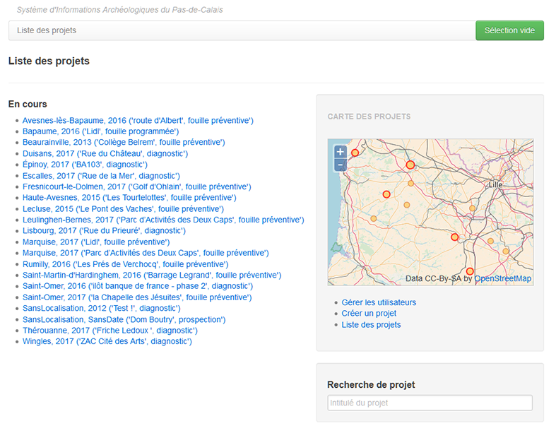

Se connecter au SIA
===================

L'utilisation du Système d'Informations Archéologique nécessite de disposer d'un compte utilisateur afin de faciliter la sécurité et la confidentialité des données qui y sont enregistrées. 

Obtenir un compte
-----------------

Les agents du Centre départemental d'Archéologie du  CG62 ont systématiquement accès au SIA, les autres personnes pouvant obtenir d'un compte sont :

- les personnes affiliées à des services archéologiques conventionnés
- les intervenants externes contractualisés sur un projet (cf. :ref:`def-projet`)

Une demande de compte doit être formulée par email à l'`administrateur <archeologie@pasdecalais.fr>`_ avec pour sujet "*Demande de compte*". Merci de bien vouloir indiquer dans votre message les informations suivantes :

- vos noms et prénoms en toutes lettres
- votre organisme d'affiliation et votre fonction
- le ou les projets vous concernant

Après validation du directeur du Centre départemental d’Archéologie, un email vous sera envoyé vous indiquant vos identifiants de connexion.

.. _`def-roles`:

Les différents rôles
--------------------

L'accès au SIA s'organise autour du concept de rôle. Un rôle se définit comme étant un ensemble de droits en écriture, la lecture n'étant pas limitée. Cela permet de compartimenter les actions possibles selon les responsabilités et les besoins de chacun, par exemple un médiateur n'aura pas à modifier la description d'un mobilier mais gardera la possibilité de la lire et de voir la documentation associée.

Un compte utilisateur peut disposer de plusieurs rôles qu'il est nécessaire de distinguer :

- *un rôle par défaut* : il s'agit d'un rôle indépendant de tout projet qui permet d'affecter des droits sur l'ensemble de l'application (p. ex. administrateur ou régisseur). Dans un but de partage et de diffusion des connaissances, tous les rôles ont de base la possibilité de consulter tous les projets en mode lecture.

- *un rôle par projet* : il s'agit du rôle propre à un seul projet, un même utilisateur peut avoir des rôles différents de son rôle par défaut. De cette façon, un utilisateur dont le compte par défaut est limité à celui de technicien peut se voir attribuer le rôle (et donc les droits) de spécialiste dans le cadre d'un projet.

Les rôles d'un compte utilisateur peuvent être différents de la fonction exercée.

Il existe 9 rôles :

administrateur : 
	ce rôle peut accéder à tout, il est destiné à la gestion opérationnelle du SIA
médiateur : 
	ce rôle est limité à la création et l'association de documents
null :
	ce rôle ne procure aucun droit
secrétaire :
	 ce rôle est limité aux renseignements administratifs et à la documentation associée
spécialiste : 
	 ce rôle a les mêmes accès que celui de technicien mais peut utiliser les champs de spécialisation du formulaire de mobilier ainsi que renseigner les traitements effectués
référent SIG : 
	 ce rôle est destiné à l'ajout et à la modification des données géographiques du projet
régie : 
	 ce rôle a accès au formulaire de régie permettant la gestion du stockage des contenants et du mouvement des mobiliers
RO/adjoint : 
	 ce rôle a accès à tous les formulaires
technicien : 
	 ce rôle a accès aux formulaires d'UE, de mobilier (les champs généralistes) et de documentation

Accéder au SIA
--------------

L'entrée dans l'application se fait via le site internet `sia.archeologie.pasdecalais.fr <http://sia.archeologie.pasdecalais.fr/>`_ dans votre navigateur.

Veuillez saisir vos identifiants dans les 2 boîtes situées en bas à droite de la page puis cliquez sur le bouton *Go*.

Cette page affiche plusieurs blocs :

- à gauche, il s'agit d'une liste de liens vers les projets considérés comme **En cours**

- à droite se trouve la *Carte des projets*, elle affiche la position de tous les projets en cours

- en-dessous de cette carte figurent trois liens
  
  - **Gérer les utilisateurs**
  - **Créer un projet**
  - **Liste des projets**, elle permet d'obtenir l'intégralité des projets existants

- en bas à droite, la barre **Recherche du projet** permet d'obtenir tous les projets contenant le terme voulu.

