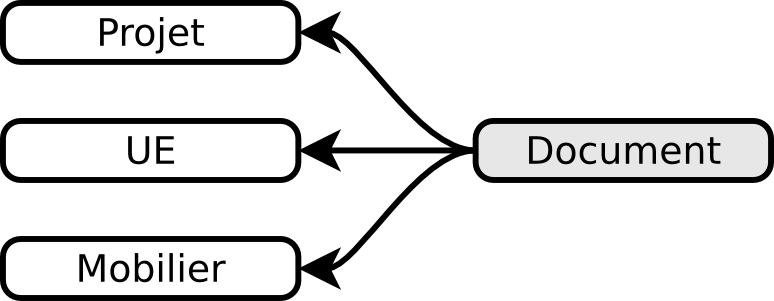
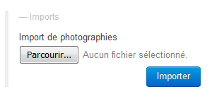

Le formulaire Document
=======================

Description
------------

La documentation scientifique des projets est composée de tous les documents originaux, produits lors de la réalisation de l’opération et des études postérieures, qu’il s’agisse de documents physiques ou de documents numériques. Ce formulaire permet d'inventorier toutes les ressources documentaires et de les lier directement à leur objet d'étude tel que l'UE ou le mobilier.

Renseigner
----------

Pour procéder à la création d'un nouvel enregistrement de document, il faut passer par la page d'accueil du projet et cliquer sur le bouton :guilabel:`créer` du bloc Documents, le nouvel enregistrement sera automatiquement lié au projet.

Pour créer 

Le bloc dispose de deux autres boutons :guilabel:`arrêté` et :guilabel:`photographie` qui permettent d'ouvrir des fiches de saisie spécifiques à ce type de documents.

Les informations générales
^^^^^^^^^^^^^^^^^^^^^^^^^^
Champs généraux:

- **Nom**
- **Série**
- **Dossier**
- **Ensemble**
- **Description**
- **Catégorie**
- **Nature du support** : Indique précisément le type support.
- **Format** : Format pour les documents sur support traditionnel ou extension informatique pour les documents numériques (.jpg).
- **Objet/lot** : Permet de définir s’il s’agit d’un objet individualisé ou un lot.
- **Nombre d'éléments** : Nombre d’éléments composant le lot (« 1 » pour objet).
- **Date de réalisation**
- **Auteur** : Individu ayant réalisé le document.
- **URL** : chemin absolu pointant vers le fichier (``S:\mon_dossier\mon_fichier.jpg``)

Champs spécifiques à un arrêté :

- **Numéro d'arrêté**
- **Date de réception**

Champs spécifiques à une photographie :

- **Orientation**
- **Sujet**
- **Champs**

Les UE liées
^^^^^^^^^^^^^

Le bloc **UE** liste les enregistrement concernés par ce document, un document pouvant être lié à plusieurs UE différentes.

Les mobiliers liés
^^^^^^^^^^^^^^^^^^

Le bloc **Mobiliers** liste les enregistrement concernés par ce document, un document pouvant être lié à plusieurs mobiliers différents.

Les contenants liés
^^^^^^^^^^^^^^^^^^^^

Un document physique (p. ex. un tirage papier) peut être placé dans un contenant tel qu'une boîte à archive A4, dans ce cas le champs *Matière contenant* sera égal à *documentation*.

Ce bloc peut lister plusieurs contenants si le document est considéré comme un **lot** (p. ex. toute la correspondance administrative), auquel cas il peut arriver qu'un seul contenant ne soit pas suffisant pour tout accueillir.

Supprimer
---------

En cas de saisie erronée ou superflue, il est possible de supprimer une fiche de document en cliquant sur le bouton :guilabel:`supprimer` qui se situe à gauche du bouton :guilabel:`Annuler`. 

.. warning::
    **Supprimer un document**
    
    Faites bien attention à ne pas juger trop vite de l'inutilité d'un document, il peut avoir été lié à d'autres UE/mobiliers pour lequel il est encore pertinent.

Exporter
--------

Il est possible d'exporter au format CSV une sélection de documents obtenue en utilisant le moteur de recherche.

L'export disponible sous le nom *Inventaire de la documentation* se compose des colonnes suivantes :

- Code opération
- Série
- Dossier
- Ensemble
- Numéro UE : compile dans une même cellule tous les numéros d'UE liées au document
- Identifiant
- Catégorie
- Légende
- Identifiant mobilier : compile dans une même cellule tous les numéros de mobiliers liés au document
- Auteur
- Nature support
- Format
- Objet/lot
- Nombre d'éléments
- Date de réalisation
- Type de Contenant
- Numéro contenant 

L'export disponible sous le nom *Inventaire de la documentation (pour impression)* est beaucoup plus simple que le précédent, il est principalement destiné à l'intégration dans les rapports finaux d'opération et est conforme au protocole SRA :

- Identifiant
- Légende : cette colonne regroupe les informations des champs Série, Dossier, Détermination et Description
- Nature support
- Format
- Nombre d’éléments 

Import des données "documents photographiques"
----------------------------------------------

Pour importer massivement des documents relatifs aux photographies du projet, appuyer sur le bouton :guilabel:`Parcourir...` de *Import de photographies* dans la fenêtre *Imports* depuis la page d'accueil du projet, pour sélectionner le fichier csv d'import. Appuyer alors sur le bouton :guilabel:`Importer` pour effectuer son intégration dans le SIA.
Vous trouverez ensuite l'ensemble des données importées dans la rubrique *Documents*, onglet :guilabel:`photographie`.

.. note::
   **Rappels concernant l'enregistrement préalable des photos et des mots-clés dans Adobe Bridge :**

- Les champs 1 à 3 sont obligatoires. S'ils ne sont pas remplis, lors de la procédure d'import, un message d'erreur apparaîtra.

- Les champs 4 et 5 sont facultatifs. Si des numeros d'UE sont enregistrés, vous devez les rentrer sous le format suivant **05-UEXXXX**. Cette syntaxe permettra d'effectuer la relation entre le document et le numéro d'UE. **Attention !** Si vous ne respectez pas ce format, l'import des photos se fera, mais vous n'aurez pas le lien. **Aucun message d'erreur n'apparaîtra !**

Pour générer le fichier csv :

- aller chercher le script, soit dans le dossier du serveur interne "0_doc_a_supprimer_au_final" de l'opération, si cette dernière a été créée à partir de février 2018, soit dans le dossier ressource dans "S:> Pole Reussites Citoyennes >  Archeologie > documentation > normes > 1 organisation serveur site > 0 doc a supprimer au final". Le nom du fichier est *"2018_export_mots_cles.jsx"*;

- copier/coller le script dans l'onglet d'Adobe Bridge : Edition > préférences > Script de démarrage > afficher les scripts;

- redémarrer Adobe Bridge;

- après la réouverture, saisir le nom du fichier accompagné de l'extension **".csv"** du menu métadonnées > sélection du répertoire. Ne pas oublier de cocher "nom" et "mots-clés".

.. warning::
**Avertissement** : si dans le dossier photo d'Adobe Bridge, il existe un autre type de fichier (par exemple, celui de la demande de photos), ce dernier apparaîtra dans le fichier d'import csv créant une erreur lors de son intégration dans le SIA. **Il est donc impératif de le supprimer avant de générer le fichier d'import**.
