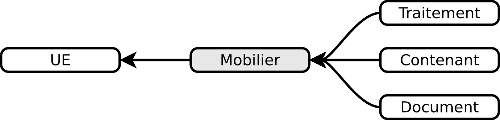

Le formulaire Mobilier
======================

Description
-----------

Le mobilier archéologique est composé de tous les éléments mobiliers (artefacts) et les matériaux naturels et de nature biologique (mnnb ou écofacts) recueillis lors de l’opération. Ce formulaire permet d'inventorier tous les objets mobiliers et de les lier directement à une UE ou à des documents.

Renseigner
----------

La création d'un enregistrement mobilier se fait uniquement en passant par un enregistrement UE existant et en cliquant sur le bouton :guilabel:`créer` de son bloc *Mobilier*, le lien entre les deux est fait automatiquement. Cette obligation lie automatiquement un mobilier à un emplacement géographique tel qu'une UE. Ce lien permet d'avoir une vue spatialisée dans le cadre cartographique de la fiche et permet d'observer le contexte de découverte.

Les informations générales
^^^^^^^^^^^^^^^^^^^^^^^^^^

- **Numéro** : numérotation de 1 à n pour tout mobilier faisant l’objet d’une photographie, d’un dessin, d’une restauration, d’une étude particulière, d’un moulage, etc. Les lots peuvent également porter un numéro d’ordre.
- **Précision**

- **Matière** : **saisie obligatoire**
- **Matière Type** : **saisie obligatoire**, cette liste est conditionnée par la valeur saisie dans la liste *Matière*.
- **Type Précision** : cette liste est conditionnée par la valeur saisie dans la liste *Matière Type*.
- **Détermination** : Identification de l’objet ou du lot en fonction des usages du responsable d’opération et de l’avancement des études.

- **Objet/lot** : Identification de l’objet ou du lot en fonction des usages du responsable d’opération et de l’avancement des études.
- **Nombre d'éléments** : Nombre d'éléments qui composent le lot ou l’objet (la précision au fragment près pour les lots volumineux n’est pas exigible).
- **Commentaire** : si nécessaire, vous pouvez décrire plus en détail ce mobilier (quelques mots au maximum). Il est déconseillé d'y faire figurer ce qui est ou peut être décrit dans un autre champ, cela permet de faciliter les recherches et d'éviter les redondances inutiles. Le nombre de caractères est limité à 255.

- **Chronologie début** : liste présentant les grandes périodes chronologiques (Moyen Âge, Néolithique, etc.) auxquelles peut se rattacher le mobilier
- **Sous-chronologie début** : liste présentant les sous-découpages des périodes chronologiques
- **Chronologie fin** : liste présentant les grandes périodes chronologiques (Moyen Âge, Néolithique, etc.) auxquelles peut se rattacher le mobilier
- **TPQ** : Terminus Post Quem, il s'agit de la date plancher (la plus ancienne). Pour mentionner une date avant notre ère il faut rajouter un **-** devant et non pas *avant J.-C*. Les dates exprimées n'ont pas à être des valeurs absolues mais peuvent simplement se comprendre comme les bornes d'une période.
- **Sous-chronologie fin** : liste présentant les sous-découpages des périodes chronologiques
- **TAQ** : Terminus Ante Quem, il s'agit de la date plafond (la plus récente). Pour mentionner une date avant notre ère il faut rajouter un - devant. Les dates exprimées n'ont pas à être des valeurs absolues mais peuvent simplement se comprendre comme les bornes d'une période.

- **État sanitaire** : Indique l'état sanitaire au moment du transfert.
- **État de représentativité** : Pourcentage indiquant de manière sommaire l'état de morcellement de l'objet.
- **État de conservation** : Indique le niveau de conservation du mobilier.
- **Composite** : Si le mobilier est composite, saisir les codes à 3 chiffres (cf. protocole SRA) séparé par un « ; ».
- **Date de découverte** : Indique à quelle date le mobilier a été découvert.
- **Valeur assurance**

Les champs spécialistes
************************

Afin de répondre aux besoins des études de mobiliers, des champs supplémentaires peuvent être activés pour les mobiliers suivants :

- anthropologie
	- Région anatomique
	- Os principal
	- Os partie concernée
	- Caractères discrets
	- [...]
- archéozoologie
	- Âge
	- Espèce
	- Region anatomique
	- Os principal
	- Os partie concernee
	- Latéralisation
	- Epiphysation
	- Sexe
	- Trace
- céramique
	- Catégorie
	- Type
	- Pâte
	- Bord
	- Panse
	- Fond
	- Anse
	- NMI
	- Décor
	- Cuisson
	- Traitement de surface
	- Description lèvre
	- Description bord
	- Description col
	- Description épaulement
	- Description panse
	- Description fond
	- Réf. biblio.
- lapidaire
	- Revêtement
	- Liant
	- Marquage
- lithique
	- Technologie
	- Typologie
	- Fragment
- monnaie
	- Représentation
	- Inscription avers
	- Description avers
	- Inscription revers
	- Description revers
	- Exergue
	- Atelier

L'activation se fait en sélectionnant la spécialité dans la liste déroulante *Choisir la spécialité* située en bas du formulaire, cette action n'est pas réversible. Les spécialités sont mutuellement exclusives et sont strictement conditionnées par les valeurs sélectionnées dans les champs *Matière* et *Matière type*.

La spécialité anthropologique dispose d'un bloc mesure distinct dans le but de ne pas surcharger la liste des mesures les plus générales ainsi que de blocs supplémentaires pour les pathologies et les connexions.

La possibilité d'utiliser ces champs est réservée aux utilisateurs ayant un rôle de spécialiste assigné pour le projet.

Les relations inter-mobiliers
^^^^^^^^^^^^^^^^^^^^^^^^^^^^^

A l'instar des UE, il est possible de lier des enregistrements mobiliers entre eux en passant par le panier de sélection, 3 types de relations peuvent être mises en place :

- **appartient** : indique que l'enregistrement mobilier A défini en tant qu'objet appartient à l'enregistrement mobilier B qui lui est défini en tant que lot. Dans le cas d'une étude anthropologique, un enregistrement mobilier peut être renseigné pour chacun des os d'un squelette, chaque os sera défini en tant qu'**objet** dans le champ *objet/lot* tandis que l'enregistrement du squelette sera lui défini en tant que **lot**. Tous les os/objet pourront de cette manière être rattachés au squelette/lot.
- **comporte** : indique que l'enregistrement mobilier A défini en tant que lot comporte l'enregistrement mobilier B qui lui est défini en tant qu'objet. Il n'y a pas de limite au nombre d'objets que peut comporter un lot.
- **remonte** : indique avec quels autres enregistrements mobiliers se fait le remontage.

.. note::
    **Exemple d'utilisation des relations entre plusieurs mobiliers**

    #. Lors de l'étude céramique les enregistrements de fragments A et B sont créés en tant qu'objets.
    #. A recolle avec B, la relation *remonte* permet de l'indiquer.
    #. Un lot C est créé pour renseigner les informations de la forme céramique ainsi retrouvée, la relation *comporte* permet d'indiquer que les fragments A et B en font parti.

Les mesures
^^^^^^^^^^^

Il est possible de renseigner plusieurs mesures pour un mobilier via le bloc **Mesures** et le bouton :guilabel:`créer`. Il faut ensuite commencer par choisir le type de mesure voulue puis saisir la valeur numérique. 

Il n'est pas nécessaire d'indiquer l'unité de mesure car de manière générale les mesures de taille sont considérées comme étant en centimètre, celles de volume en litre et celles de poids en gramme. Le séparateur décimal est le point, p. ex. *27.8* (et non pas la virgule).

Chaque mesure est associée automatiquement au mobilier à partir de laquelle elle a été créée. Il est préférable de supprimer une mesure inutile plutôt que la dissocier.

Les statuts juridiques
^^^^^^^^^^^^^^^^^^^^^^

Chaque enregistrement mobilier peut se voir affecter successivement statuts juridiques différents via le bloc **Statuts juridiques** et le bouton :guilabel:`créer`, chacun de ces statuts doit être datés. Cela permet de conserver un historique des changements de statut d'un mobilier.

Les documents
^^^^^^^^^^^^^

Ce bloc liste tous les documents liés au mobilier courant, chaque ligne représente un document et indique sa série, son dossier ainsi que son numéro identifiant (p. ex. *Administratif - Correspondance - 25*). L'utilisation du bouton :guilabel:`créer` permet de créer un nouveau document qui sera automatiquement lié au mobilier.

Les contenants
^^^^^^^^^^^^^^

Ce bloc liste tous les contenants liés au mobilier courant, chaque ligne représente un contenant. L'utilisation du bouton :guilabel:`créer` permet de créer un nouveau contenant qui sera automatiquement lié au mobilier.

Les traitements
^^^^^^^^^^^^^^^

Ce bloc liste le ou les traitements subis par le mobilier.

Exporter
--------

Il est possible d'exporter au format CSV une sélection de mobilier obtenue en utilisant le moteur de recherche.

Les exports généralistes
^^^^^^^^^^^^^^^^^^^^^^^^

L'export disponible sous le nom *Inventaire du mobilier* se compose des colonnes suivantes :

- Code opération
- Matière
- Type
- Composite
- UE
- Identifiant SRA
- Détermination
- Objet/lot
- Nombre d’éléments
- Remontage
- Poids (g)
- État de conservation
- État sanitaire
- Préservation à envisager
- Numéro contenant
- Type de contenant
- Parcelle de découverte
- Date de découverte
- Chronologie
- TPQ
- TAQ
- Traitement
- Lieu de conservation

L'export disponible sous le nom *Inventaire du mobilier avec géométrie* reprend les mêmes champs en rajoutant une colonne contenant la géométrie au format WKT (voir :ref:`def-wkt`).

L'export disponible sous le nom *Inventaire du mobilier — impression* est beaucoup plus simple que le précédent, il est principalement destiné à l'intégration dans les rapports finaux d'opération et est conforme au protocole SRA :

- UE
- Identifiant : Numéro de mobilier tel que défini par le protocole SRA
- Détermination : rassemble les champs Matière, Type et Détermination 
- Nombre d'éléments
- Poids (g)
- État de conservation
- État sanitaire
- Préservation à envisager
- Parcelle de découverte : obtenue par la localisation de l'UE auquel est affecté l'objet
- Chronologie

Les exports spécialisés
^^^^^^^^^^^^^^^^^^^^^^^^

Ces exports comprennent l'intégralité des champs spécialistes ainsi que toutes les mesures associées aux mobilier, les exports disponibles sont :

- archéozoologie
- anthropologie
- céramique
- lapidaire
- lithique
- monnétaire