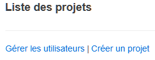
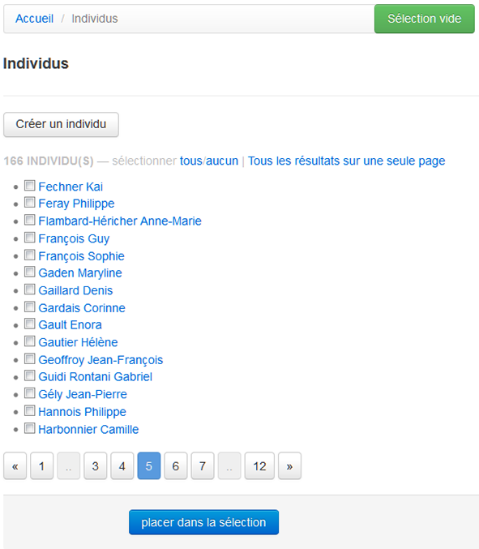
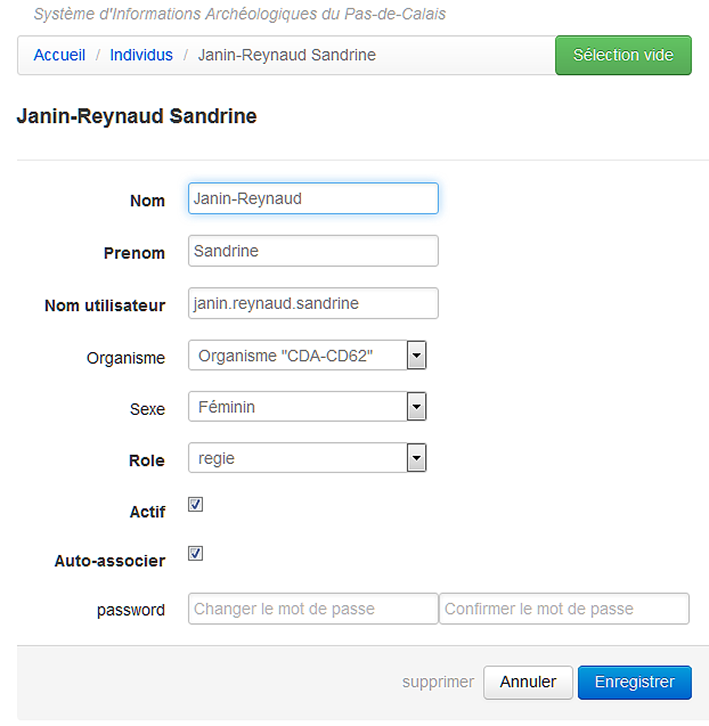
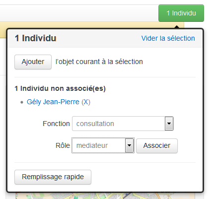

Gestion des utilisateurs
========================

Description
-----------

Seules les personnes ayant un rôle administrateur peuvent accéder aux fonctions de gestion des utilisateurs :

- la création d'un nouvel utilisateur
- la modification d'un utilisateur existant
- l'association d'un utilisateur à un projet

Un utilisateur ne correspond pas nécessairement à une utilisation réelle, un compte utilisateur peut être créé afin de pouvoir associer un individu à une régie ou un document sans que cet individu accéde au SIA.

L'interface
^^^^^^^^^^^

L'accès à cette gestion se fait par le lien *Gérer les utilisateurs* présent dans la partie supérieure de la page d'acceuil des projets. Ce lien conduit vers une page listant l'intégralité des comptes utilisateurs dans l'ordre alphabetique, cette interface reprend le mode de fonction de la page de résultat de recherche (:ref:`recherche-utilisation`).

Les informations générales
^^^^^^^^^^^^^^^^^^^^^^^^^^

Chaque utilisateur peut être défini par les détails suivants :

:Nom: **obligatoire** - indique le nom de l'individu. 
:Prénom: **obligatoire** - indique le prénom de l'individu. 
:Nom utilisateur: il s'agit de l'identifiant à saisir pour la connexion. par convention, il est se compose du nom et du prénom accolé par un point, le tout en minuscule et sans caractère accentué (snow.john).
:Organisme: indique à quel organisme est lié l'individu.
:Sexe: indique le sexe de l'individu. 
:Role: **obligatoire** - il s'agit du rôle par défaut de l'individu. Si un utilisateur à le rôle *regie* par défaut ainsi que le paramètre *auto-associer*, il sera associé à chaque nouveau projet avec ce rôle et les droits qui en découlent.
:Actif: **obligatoire** - indique si cet utilisateur peut se coonecter au SIA.
:Auto-associer: **obligatoire** - indique si l'utilisateur doit être automatiquement associé à chaque création d'un nouveau projet.
:password: permet de saisir le mot de passe ou de modifier l'existant.

.. warning::
    **Rôle par défaut != rôle par projet**
    
    Le rôle d'un utilisateur peut être différent d'un projet à l'autre, il n'est pas conseillé de mettre un rôle par défaut donnant des droits élevé si le besoin de ces droits ne s'applique qu'à un seul projet bien précis. Si vous définissez un agent auto-associé comme ayant par défaut le rôle *ro_adjoint*, il pourra modifier toutes les informations de **tous** vos nouveaux projets. 
    
    Mettez un rôle par défaut répondant aux besoins minimums (p.ex. *mediateur* pour un accès en lecture) et changez le rôle au cas par cas lors de l'association à un projet.

Création d'un nouvel utilisateur
--------------------------------

1. Rendez-vous sur la page *Individus* en cliquant sur *Gérer les utilisateurs*
#. Cliquez sur le bouton *Créer un individu*
#. Saisissez les informations obligatoires

   a. cochez *auto-associer* uniquement si vous voulez que cet utilisateur soit lié à tout vos nouveaux projet
   b. mettez un rôle par défaut ayant le minimum de droit (cf. :ref:`def-role`)
   c. décochez la case *actif* si cet individu n'a pas vocation à se connecter au SIA
#. Cliquez sur *Enregistrer* si vous n'aviez qu'un utilisateur à intégrer ou sur *Enregistrer et créer* si vous en avez une série.

Associer un utilisateur à un projet
-----------------------------------

1. Via la page *Individus*, ajoutez un ou plusieurs utilisateurs

   a. en cliquant sur le bouton vert du panier puis sur * ajouter à la sélection*
   b. en cochant dans liste tous les individus concernés puis en cliquant sur le bouton bleu *placer dans la sélection*
   
#. Déplacez-vous sur la page d'acceuil du projet auquel vous voulez lier l'utilisateur ou actualisez la page du projet

#. Cliquez sur le panier

   a. sélectionnez une fonction, elle indique le motif de la participation au projet (céramologue, consultation, récolement, etc.)
   b. sélectionnez un rôle, ce choix affecte les droits d'accès et est spécifique à ce projet
   
#. Cliquez sur le bouton *Associer* pour terminer

Cette procédure va définir un seul type de relation pour les individus sélectionnés. Si vous voulez définir des associations fonction/rôle distinctes pour chaque individu, il faudra répéter la maoeuvre autant de fois que vous avez d'associations.

Dissocier un utilisateur d'un projet
------------------------------------

1. Sélectionnez l'utilisateur et placez le dans votre panier
#. Déplacez-vous sur le projet
#. Cliquez sur le panier
#. Cliquez sur le bouton *Dissocier*

Supprimer un utilisateur
------------------------

Même si la suppression est possible, il est préférable d'enlever le statut *actif* de ce compte utilisateur car il peut être lié à des enregistrements en tant qu'auteur d'un document, prestataire d'une régie, etc.
