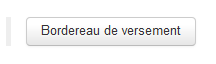
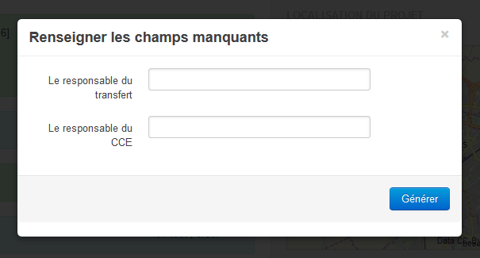

Les concepts généraux et l'interface
====================================

Il est recommandé de lire ce manuel en ayant l'application devant soi, chaque utilisateur ayant accès à un projet de test lui permettant d'essayer les différents concepts expliqués ci-dessous au fur et à mesure de sa lecture.

.. note::
    **Bien choisir son navigateur**
    
   L'application a été codée dans le respect des normes W3C (HTML, CSS, etc.) et utilise intensivement le langage JavaScript pour la partie cliente. Pour une meilleure expérience (et pour éviter moults bugs), il est déconseillé d'utiliser une version d'Internet Explorer inférieure à la 9. De manière générale, il est plutôt conseillé d'utiliser Firefox, Chrome ou Safari dans leurs versions les plus récentes.  

Les formulaires
-----------------

Un formulaire est un ensemble de champs et de listes déroulantes permettant de renseigner un enregistrement tel qu'un mobilier ou un document.

Chaque formulaire remplit le double rôle d'interface de saisie et de lecture. L'ajout et l'édition d'enregistrements se font avec la même interface et les mêmes champs que la simple lecture.

Les principaux formulaires existants  :

#. projet
#. unité d'enregistrement
#. mobilier
#. phase
#. traitement
#. régie
#. contenant
#. documentation

Les vignettes
^^^^^^^^^^^^^

Les vignettes sont présentes dans la quasi-totalité des formulaires. Elles regroupent des données sous une forme synthétique (décompte, résumé, etc.) et permettent d'accéder à d'autres formulaires de manière rapide.

une vignette peut disposer des 2 fonctions suivantes :

- :guilabel:`Voir tout` : ce bouton affiche une page de résultat listant tous les enregistrements du même type.

- :guilabel:`Créer` : ce lien ouvre un nouveau formulaire vide prêt à être renseigné.

Le contenu d'une vignette se compose d'une série de liens, leur apparition est dynamique et conditionnée par les enregistrements effectués dans le projet. Un clic sur un lien peut amener :

* sur une page de résultat dans le cas d'un lien de décompte (p. ex. pour le mobilier *céramique [14]*)
* directement sur la page de l'enregistrement dans le cas d'un lien de relation (*Abandon (462 / 480)*)

.. note::
    **Faire apparaître toutes les vignettes d'une fiche**
    
   Pour faire apparaître toutes les vignettes (champs spécialistes ou interelation...), il faut enregistrer la fiche de formulaire. Tant que la fiche ne l'a pas été au moins une fois, le formulaire se limitera aux champs et listes minimaux.

Le cadre cartographique
^^^^^^^^^^^^^^^^^^^^^^^

Ce cadre est présent à droite de l'écran à chaque fois qu'il est possible de localiser géographiquement un enregistrement, soit par sa position ou soit par la position d'une de ses relations.

La position de l'enregistrement apparaît en surbrillance pour le distinguer des autres formes présentes sur la carte.

Le clic gauche appuyé permet de se déplacer sur la carte tandis que la molette de la souris permet de reculer ou d'avancer le niveau de zoom.

Enregistrer un formulaire
^^^^^^^^^^^^^^^^^^^^^^^^^

Lorsque des données sont saisies dans un formulaire, il est **impératif** de cliquer sur le bouton :guilabel:`Enregistrer` pour que celles-ci soient sauvegardées par l'application. Pour éviter des erreurs de saisies non-voulues, il n'y a **aucune** sauvegarde automatisée.

Le bouton :guilabel:`Enregistrer et créer` permet de procéder en un seul clic à l'enregistrement de la page courante et à l'ouverture d'une nouvelle page prête à la saisie. Ce mode est particulièrement adapté à la saisie à la chaîne car les informations saisies dans la première fiche sont automatiquement reportées dans la nouvelle, il n'y pas besoin de resaisir les informations générales qui ne varient pas entre les enregistrements. Par contre, il faut faire bien attention à ne pas laisser des informations présentes sur le modèle mais qui ne s'appliquent pas à la nouvelle fiche.

.. warning::
    **Perte des modifications**
    
   Toute donnée non-enregistrée lorsque l'utilisateur quitte un formulaire est considérée comme perdue. Il est toutefois possible de revenir en arrière en utilisant la fonction *Reculer d'une page* présente dans tous les navigateurs, l'utilisateur peut alors enregistrer les données modifiées. Cette fonction est très pratique mais ne doit pas devenir un modus operandi car le nombre de retours possibles n'est pas infini, il suffirait d'un plantage de l'ordinateur pour que tout se volatilise.

Se déplacer
-------------

Le fil d'Ariane
^^^^^^^^^^^^^^^^

Ce fil est toujours placé en haut de l'écran, sa fonction est d'indiquer où se situe la page lue par l'utilisateur. Son sens de lecture représente la hiérarchie des enregistrements :

- *Liste des projets /* : permet de revenir à la page d'accueil de l'application et de sélectionner un projet différent
- *Dom Boutry /* : permet de revenir à la page d'accueil du projet
- *UE #17695 /* : permet de revenir à la page du formulaire de cette UE
- *pierre autre (UE 1)* : ce dernier apparaît grisé, il s'agit du formulaire actuellement ouvert

..	figure:: ./fig/fil_ariane.png
	:align: center
	:scale: 70%

Il est donc ici possible de déduire l'appartenance du mobilier rien qu'en lisant ce fil et de le remonter en cliquant sur chacun des différents niveaux.

La barre de recherche rapide
^^^^^^^^^^^^^^^^^^^^^^^^^^^^

..	figure:: ./fig/recherche_rapide.png
	:align: center
	:scale: 80%

Cette barre figure toute en bas à gauche de l'écran, elle ne s'affiche que lorsque l'utilisateur est entré dans un projet.

Elle permet les recherches suivantes :

- *voir l'UE*, affiche directement la fiche de formulaire correspondant à l'UE saisie, c'est la recherche par défaut.
- *voir les documents de l'UE*, affiche une page de résultats listant tous les documents liées à l'UE saisie.
- *voir les mobiliers de l'UE*, affiche une page de résultats listant tous les mobiliers liées à l'UE saisie.
- *voir les contenants l'UE*, affiche une page de résultats listant tous les contenants liées à l'UE saisie.

Pour lancer la recherche, il faut :

#. choisir le type de recherche.
#. saisir le numéro de l'UE.
#. cliquer sur le bouton :guilabel:`Chercher`. 

Pour des recherches plus avancées, il faut cliquer sur *recherche du projet* (voir la section :ref:`recherche-moteur`).

Les onglets de l'explorateur 
^^^^^^^^^^^^^^^^^^^^^^^^^^^^

Un des principaux intérêts de travailler en utilisant un navigateur internet est la possibilité d'exploiter le principe des onglets : au lieu de multiplier les fenêtres et de surcharger l'espace de travail, il est possible d'avoir plusieurs formulaires ouverts en même temps.

Si l'utilisateur consultant le formulaire Céramique désire avoir les informations relatives à l'UE d'appartenance, il lui suffit d'ouvrir un onglet sur l'UE sans avoir à quitter celle du mobilier.

Une autre possibilité est d'ouvrir plusieurs formulaires de saisie en ouvrant des onglets sur le raccourci :guilabel:`Créer un nouveau XXX`, ce qui permet de faire des saisies à la chaîne.

Pour ouvrir un nouvel onglet, vous pouvez :

- faire un clic droit sur un lien et cliquer sur *Ouvrir un lien dans nouvel onglet*.
- faire un clic milieu ou molette sur un lien.
- utiliser le raccourci :kbd:`Ctrl+N`

.. warning::
    **Éviter les onglets périmés**
    
   Pour éviter d'avoir un onglet dont le contenu est complétement dépassé suite à des modifications d'autres utilisateurs ou la création de nouvelles relations, il faut le rafraîchir. La touche :kbd:`F5` permet d'effectuer cette action. Cela évite également d'avoir un onglet affichant un panier avec 5 enregistrements alors que l'utilisateur vient de le vider sur un autre onglet. Avec un clic droit sur un onglet, il est possible d'*actualiser tous les onglets* existants en une fois.
   
Les marque-pages
^^^^^^^^^^^^^^^^

Un marque-page permet au navigateur web de mémoriser le lien vers la page pour pouvoir y revenir ultérieurement, sans devoir refaire tout le chemin dans l'application. Il est utile de faire un marque-page :

* sur le projet en cours, cela évite de passer par la page d'acceuil.
* sur une page de résultat, cela permet de ne pas avoir à recomposer la recherche.

Il faut au préalable être connecté pour pouvoir utiliser un onglet, dans le cas contraire le SIA vous en refusera l'accès.

Le panier
---------

Le principe
^^^^^^^^^^^^^^^^^^^^^^

Le panier est utilisé pour :

- établir des relations stratigraphique entre UE
- établir des relations entre mobiliers
- placer des documents et des mobiliers dans des contenants

Il se situe en haut à droite de l'écran sur la totalité des formulaires. Il remplit le même rôle qu'un panier de course sur un site commerçant : l'utilisateur y place les enregistrements de son choix.

..	figure:: ./fig/panier_vide.png 
	:align: center
	:scale: 70%

Le bouton du panier affiche par défaut *Sélection vide*. Si un ajout est effectué, il affichera le nombre d'enregistrements concernés et le type général (*1 Mobilier*, *12 UEs*, etc.).

Il n'est pas possible d'avoir plusieurs enregistrements de type différents dans un même panier, il faudra par exemple choisir entre faire une sélection d'UE et faire une sélection de mobiliers.

L'utilisation
^^^^^^^^^^^^^^^^^^^^^^

Remplir par lot
"""""""""""""""""

L'utilisateur effectue une recherche et clique sur le bouton :guilabel:`placer dans la sélection` (voir :ref:`recherche-utilisation`).

Remplir par enregistrement 
""""""""""""""""""""""""""""""""

L'utilisateur se déplace sur un enregistrement existant, clique sur le panier puis clique sur :guilabel:`Ajouter  l’objet courant à la sélection`. L'action est à répéter sur chaque enregistrement que l'utilisateur veut faire figurer dans son panier.

.. _`def-remplissage-rapide`:

Remplir par remplissage rapide
""""""""""""""""""""""""""""""""

L'utilisateur clique sur le bouton :guilabel:`Remplissage rapide`. Une nouvelle fenêtre s'ouvre dans laquelle il est possible de saisir à la main les différents numéros d'UE qui seront ajoutés au panier, sans que cela supprime ceux qui y figuraient déjà. Cette fonction est pratique dans le cas des relations stratigraphiques puisqu'il n'est alors pas nécessaire de parcourir chacune des fiches UE pour les ajouter à la sélection. 

La saisie des numéros d'UE se fait en tapant chaque numéro à la suite en les séparant par un point-virgule :kbd:`;`, *31;64;75*.

Pour accélérer la saisie, il est possible de définir des intervalles pour sélectionner un groupe d'UEs en indiquant une borne minimale et une borne maximale séparées par le caractère :kbd:`-`, l'intervalle *5-200* remplira le panier avec toutes les UEs dont le numéro est supérieurs ou égaux à 5 mais inférieurs ou égaux à 200.

Les intervalles peuvent se combiner avec des sélections individualisés (*1;3;4-20;23*).

..	figure:: ./fig/panier_rapide.png 
	:align: center
	:scale: 70%

Vider le panier
"""""""""""""""""

Pour vider complétement la sélection du panier, il faut cliquer dans le panier sur le lien *vider la sélection*.

Pour supprimer un seul enregistrement de la sélection, il faut ouvrir le panier et cliquer sur le bouton :kbd:`X` figurant à sa droite.

La case *Remplacer la sélection* du remplissage rapide permet de remplacer le contenu du panier par les numéros saisis au lieu de les y ajouter.

.. warning::
    **Enregistrer avant d'associer**
    
    Si vous êtes sur une nouvelle fiche de formulaire, il faut toujours l'enregistrer avant de pouvoir procéder à une quelconque association.

Les relations
-------------

Il s'agit des associations établies entre au moins deux enregistrements, cela indique qu'ils sont liés et active certaines fonctionnalités telle que l'affichage dans un bloc.

La plupart des relations sont établies de manière automatique lors de l'utilisation du bouton :guilabel:`Créer` ou des raccourcis du genre :guilabel:`Créer un nouveau mobilier`.

Les deux principales relations sont celles entre UE et celles entre mobiliers. Ces relations peuvent avoir un type et un sens. Dans le cas d'une UE, une relation peut être *A coupé par B*. Le type est *"coupé par"*, le sens est de A vers B. Lorsque une relation est établie dans un sens, l'application crée automatiquement une relation dans le sens inverse (ici ce sera *"B est coupé par A"*.

Pour établir des relations supplémentaires, il faut utiliser le panier de sélection.

.. warning::
    **Les orphelins**
    
   Les enregistrements sans relations sont considérés comme orphelins (une UE dissociée de son projet, un mobilier dissocié de son UE, etc.), ces cas résultent toujours d'une action manuelle d'un utilisateur. Comme dans la vie courante, c'est un drame que tout le monde [#f2]_ aimerait éviter (voir :ref:`def-valeurs-perdues` dans la FAQ).
 

L'identifiant SRA
-----------------

..	figure:: ./fig/sra_identifiant.png
	:align: center
	:scale: 60%

Afin de se conformer au complément au cahier des charges scientifiques établit par le Service Régional d'Archéologie du Nord-Pas de Calais [#f3]_, le SIA génère automatiquement l'identifiant normalisé pour les mobiliers et les documents en utilisant le contenu des champs et des listes des formulaires.

Il est affiché en haut à droite, en-dessous du panier. Il est également exporté dans les inventaires.

Ce numéro se compose :

#. du code Patriarche (*156130*)
#. du code de mobilier ou de documentation (*113*, indique un mobilier monétaire)
#. du numéro d'UE auquel il se rattache (*355*)
#. du numéro d'ordre (*2*)

Si un de ces numéros est remplacé par un *None*, c'est qu'il n'a pas été saisi dans l'application.

Pour **copier** le numéro dans le presse-papier, il suffit de cliquer sur le bouton situé à droite du numéro. Cela vous permet d'utiliser l'identifiant pour nommer un fichier sans devoir le réécrire manuellement.

Pour plus de détails sur ce sujet, il faut se reporter à la documentation du protocole SRA.

Les exports
--------------

Voici la liste des exports tabulés actuellement réalisables, il faut se référer à la documentation des formulaires pour avoir plus de détails sur chacun :

- Inventaires principaux
	- Inventaire des UE
	- Inventaire des UE - impression
	- Inventaire des UE - avec géométrie
	- Inventaire stratigraphique simplifié
	- Export comblements géologiques
	- Inventaire UE / présentation pour rapport
	- Inventaire des contenants 
	- Inventaire du mobilier 
	- Inventaire du mobilier - impression
	- Inventaire du mobilier - avec géométrie
	- Inventaire du mobilier - anthropologie uniquement
	- Inventaire du mobilier - archéozoologie uniquement
	- Inventaire du mobilier - céramique uniquement
	- Inventaire du mobilier - lapidaire uniquement
	- Inventaire du mobilier - lithique uniquement
	- Inventaire du mobilier - monnaie uniquement
	- Inventaire des traitements
	- Export constat d'état
	- Export Fiches entités archéologiques
	- Inventaire de la documentation 
	- Inventaire de la documentation - impression

L'édition d'un bordereau de versement
---------------------------------------

L'édition des bordereaux de versement en PDF est possible à partir de la page d'accueil du projet.
Le Bouton :guilabel:`Bordereau de versement` permet la création et le remplissage automatique du document.

Une fois l'appui sur ce bouton, une nouvelle fenêtre (pop-up) apparaît demandant de renseigner deux champs. 

Renseignez les noms du Responsable du transfert et du Responsable CCE pour que ces derniers apparaissent en bas du bordereau à la suite du descriptif administratif de l'opération (nom et année de l'opération, le type d'opération, l'adresse et les références cadastrales...) et de l'inventaire des contenants versés.

La possibilité d'éditer des bordereaux est accordé aux RO, adminsitrateurs et régisseurs.

.. [#f2] En tout cas les administrateurs du SIA.
.. [#f3] Protocole pour la conservation, le conditionnement, l'inventaire et la remise du mobilier et de la documentation scientifique issus des opérations archéologiques (version du 01 octobre 2012).
