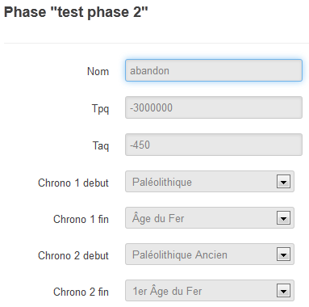

Le formulaire Phase
====================

Description
-----------

Une phase est une unité de datation permettant de découper un site selon les différents stades qu'il aura connu, elle peut être délimitée par des périodes chronologiques ou des datations absolues. On peut lui associer des Unités d'Enregistrement.

Renseigner
----------

On procède à la création d'une nouvelle phase en passant par le formulaire projet et le bouton :guilabel:`Créer` (cette fonction est limitée aux rôles ayant ce droit). 

La phase est automatiquement liée au projet dans laquelle elle a été créée (il n'est pas possible de lier une phase à plusieurs projets).

Description des champs
^^^^^^^^^^^^^^^^^^^^^^

- **Nom** : intitulé de la phase (p. ex. construction, destruction, abandon, etc.)
- **Chrono 1 debut** : (erreur d'intitulé, deviendra Chronologie début) liste présentant les grandes périodes chronologiques (Moyen Âge, néolithique, etc.) auquel peut se rattacher le début de la phase
- **Chrono 1 fin** : (erreur d'intitulé et de liste, Sous-chronologie début) liste présentant les sous-découpages des périodes chronologiques 
- **Chrono 2 debut** : (erreur d'intitulé et de liste, Chronologie fin) liste présentant les grandes périodes chronologiques (Moyen Âge, néolithique, etc.) auquel peut se rattacher la fin de la phase
- **Chrono 2 fin** : (erreur d'intitulé, Sous-chronologie fin) liste présentant les sous-découpages des périodes chronologiques 
- **TPQ** : champ de datation numérique correspondant à la date minimale
- **TAQ** : champ de datation numérique correspondant à la date maximale

Saisie de la datation
^^^^^^^^^^^^^^^^^^^^^

Seul le champ **Nom** est obligatoire pour créer une phase.

La sélection d'une période chronologique provoque le remplissage automatique du champ TPQ ou TAQ avec des valeurs par défaut. Si les champs TPQ/TAQ étaient déjà remplies, la sélection de périodes viendra écraser les valeurs pré-existantes.

Associer une UE à une phase
*^^^^^^^^^^^^^^^^^^^^^^^^^^

#. Placez-vous dans une fiche d'UE
#. Cliquez sur le bouton :guilabel:`Sélection vide` situé en haut à droite du formulaire
#. Cliquez ensuite sur *Ajouter l’objet courant à la sélection*, le bouton de sélection affiche maintenant *"1 UE"*
#. Recommencez éventuellement cette manipulation sur plusieurs autres UE, elles viendront s'ajouter à la sélection
#. Déplacez-vous maintenant dans la phase visée
#. Cliquer sur le bouton de sélection puis cliquez sur le bouton :guilabel:`Associer à l'objet courant`

Associer une phase à des UE
^^^^^^^^^^^^^^^^^^^^^^^^^^

#. Placez-vous dans une fiche de phase
#. Cliquez sur le bouton :guilabel:`Sélection vide` situé en haut à droite du formulaire
#. Cliquez ensuite sur *Ajouter l’objet courant à la sélection*, le bouton de sélection affiche maintenant *"1 Phase"*
#. Déplacez-vous maintenant dans l'UE visée
#. Cliquer sur le bouton de sélection puis cliquez sur le bouton :guilabel:`Associer à l'objet courant`

Dissocier une UE d'une phase
^^^^^^^^^^^^^^^^^^^^^^^^^^

#. Placez-vous dans la fiche d'UE
#. Cliquer sur le bouton de sélection, il affiche *1 Phase déjà associé(es)*
#. Cliquez sur le bouton :guilabel:`Dissocier  la sélection et l’objet courant`.
