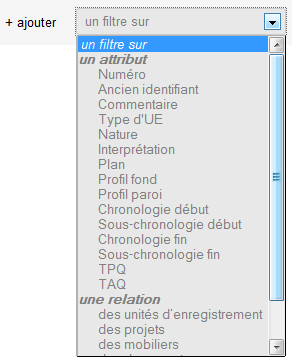
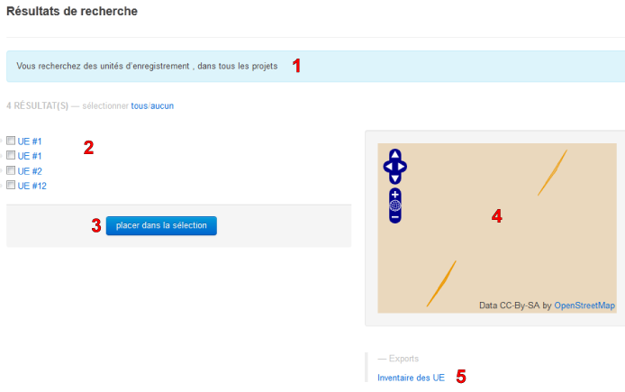

.. _`recherche-moteur`:

Effectuer une recherche
=======================

Description
-----------

La page de recherche permet d'exploiter efficacement toutes les données saisies dans le SIA, le fait que tous les formulaires soient reliés entre eux d'une manière ou d'une autre autorise des recherches croisées faciles à réaliser.

Faire une recherche
--------------------

..	figure:: ./fig/recherche_ecran.png 
	:scale: 75%

Définir une cible
^^^^^^^^^^^^^^^^^

Pour effectuer une recherche, la première étape est de choisir le type de résultat à obtenir. Les résultats possibles couvrent l'ensemble des enregistrement qui peuvent être saisis dans l'application (UE, mobilier, matrice géologique, etc.).

Ce choix se fait dans la première liste du formulaire qui se nomme *"Rechercher des"* ``(1)``.

..	figure:: ./fig/recherche_cible_liste.png 
	:scale: 40%

Définir le périmètre de recherche
^^^^^^^^^^^^^^^^^^^^^^^^^^^^^^^^^

La seconde étape est de choisir dans une liste ``(3)`` si la recherche doit s'opérer sur un projet en particulier ou sur tous. Le premier choix permet de vous limiter à une seule source de réponses tandis que le second vous permet de faire des comparaisons entre les projets. 

Le moteur vous propose également ``(2)`` de choisir entre les deux possibilités suivantes :

#. **qui valident chacune des conditions** : le résultat que vous obtiendrez répondra à tous les critères que vous mettrez en place, il suffit que l'enregistrement ne réponde pas positivement à un seul de ces critères pour qu'il ne fasse pas parti des résultats proposés.

#. **qui valident une des conditions** :  le résultat que vous obtiendrez répondra au moins à l'un des critères que vous mettrez en place.

C'est à vous de définir si vous voulez des résultats répondant strictement à votre demande initiale ou si vous voulez un ensemble plus large de réponses pour éviter de passer à côté d'un résultat potentiellement intéressant.

Définir les filtres
^^^^^^^^^^^^^^^^^^^

Les filtres ``(4)`` vont être le moyen d'obtenir uniquement les résultats qui concernent votre problématique. Pour cela, il s'agit d'utiliser les champs des différentes données stockées dans l'application pour limiter les résultats qui vous seront proposés.

Vous pouvez cumuler autant de filtres que nécessaire pour rajouter des conditions de tri, ce qui aura pour effet d'affiner les résultats qui vous seront soumis.

La première liste disponible vous propose d'ajouter un filtre sur l'un des attributs de votre cible (p. ex. *Profil Paroi* si votre cible est l'UE) ou sur une relation.

L'ajout d'une relation permet d'ajouter des filtres sur les attributs d'un enregistrement lié à l'enregistrement cible. 

.. note::
    **Exemple de recherche liée**
    
    La possibilité de faire une recherche utilisant les relations permet d'être plus sélectif. Dans le cas d'une recherche de céramiques, en ajoutant un filtre sur le type d'UE *fosse* et sur la phase *occupation*, les résultats livrés par le moteur de recherche seront beaucoup plus réduits mais beaucoup plus probants.

Il n'y a pas de limite au nombre de filtres que vous pouvez utiliser dans une recherche.

La carte présente sur cette page vous permet d'ajouter un type de filtre qui diffère des autres. En cochant la case *restreindre à l'emprise de la carte*, vous définissez une emprise spatiale pour votre recherche qui exclura toutes les données qui seront en dehors.

les opérateurs de recherche
^^^^^^^^^^^^^^^^^^^^^^^^^^^

les opérateurs numériques
"""""""""""""""""""""""""

Certains filtres vous permettent d'utiliser des opérateurs numériques suivants :

.. |neq| image:: ./fig/char_neq.png
	 :scale: 50%
.. |eqinf| image:: ./fig/char_eqinf.png
	 :scale: 50%

* =, est strictement égal à.
* |neq|, n'est strictement pas égal à.
* |eqinf|, est inférieur ou égal à.
* |eqsup|, est supérieur ou égal à.
* <, est inférieur à.
* >, est supérieur à.

Ils ne sont activé que pour les champs scrupuleusement numériques, il est n'est pas possible de les utiliser sur un champs texte contenant un chiffre : la recherche *NMI* > 5 est possible tandis que *Commentaire* = 5 ne l'est pas.

les opérateurs de texte
"""""""""""""""""""""""
    
Le joker (*"%"*) est caractère de remplacement, il permet de combler les trous dans une recherche portant sur un champ texte.

Un céramologue faisant une recherche sur toutes les céramiques de la catégorie "*groupe 2*" avec un filtre utilisant ce terme ne trouvera que les enregistrements correspondant strictement à ce terme. Toutes les variations telles que "*groupe 2 ??*", "*groupe 2 et 3*" ou "*voir groupe 2*" ne figureront pas dans la liste des résultats. 

L'opérateur joker permet d'y remédier [#f1]_ en l'insérant dans le terme recherché là où les variations peuvent être susceptibles de se glisser :

* "*groupe 2%*" permettra de trouver "*groupe 2??*"
* "*groupe%2*"  permettra de trouver "*groupeee 2*" 
* "*%groupe 2*"  permettra de trouver "*voir groupe 2*"
* "*%groupe%2%*"  permettra de trouver "*voir groupes 2 ???*"

.. [#f1] C'est une solution, l'autre étant d'avoir un enregistrement avec des termes restreints et sans fioritures inutiles.

l'opérateur d'exclusion
"""""""""""""""""""""""

La totalité des filtres dispose de la possibilité d'exclure une valeur d'une recherche en utilisant l'opérateur ``≠`` (non-égal), il permet d'écarter des enregistrements de la liste des résultats.

Pour obtenir tous les mobiliers n'étant pas de la terre cuite, il y a deux façons de faire :

- la **mauvaise** qui consiste à ajouter 4 filtres
  - 1 filtre matière « verre »
  - 1 filtre matière « métal »
  - 1 filtre matière « organique »
  - 1 filtre matière « autre »
- la **bonne** qui consiste à n'ajouter q'un seul filtre
  - 1 filtre matière « terre cuite »

Obtenir les résultats
^^^^^^^^^^^^^^^^^^^^^

Une fois vos critères définis, vous pouvez obtenir la liste des résultats en cliquant sur le bouton :guilabel:`Lancer la recherche`.

La case *dans une nouvelle fenêtre* permet d'ouvrir la liste des résultats dans un nouvel onglet de votre navigateur, l'avantage de le faire est que vous pouvez revenir à tout moment sur la page de création de la recherche pour changer des paramètres et affiner vos critères. Moralité : si l'utilisateur désire faire une recherche quantitative, il doit saisir ses chiffres dans les champs prévus à cet effet.

.. _`recherche-utilisation`:

Utiliser les résultats
----------------------

1. Les critères de votre recherche sont résumés en une phrase.
2. Les résultats sont placés sous forme de liste, chaque résultat est précédé d'une case à cocher. La ligne d'en-tête de la liste se compose du total des résultats et des boutons :guilabel:`tous` et :guilabel:`aucun` qui vous permettent de cocher/décocher l'ensemble des résultats en un clic.
3. Le bouton :guilabel:`placer dans la sélection` permet de mettre tous les résultats dont les cases sont cochées dans votre panier de sélection. Cette fonction permet par exemple de rechercher les 8 fossés ayant livré du matériel lithique et de les assigner à la phase d'occupation du Néolithique.
4. La carte va faire figurer tous les emplacements correspondant aux résultats, par exemple si vous recherchez des mobiliers céramiques vous obtiendrez sur cette carte les UE de provenance. Vous pouvez cliquer sur les formes géométriques pour sélectionner dans la liste le résultat correspondant.
5. La partie *Export*, situé sous la carte, liste les différents classeurs que vous pouvez obtenir, ces exports se font au format CSV. Seuls sont exportés les résultats qui ont une case cochée.

La recherche sur tous les projets
--------------------------------------------

Lorsqu'une recherche porte sur tous les projets ``(3)``, une page intermédiaire de résultats est affichée avec une ligne par projet répondant aux critères et le nombre de résultats pour chacun de ces projets. Le fait de cliquer sur l'un des projets listés amène sur une page de résultat classique.

..	figure:: ./fig/recherche_multiprojet.png 
	:align: center
	:scale: 50%
	:alt: Exemple de page de résultats multi-projets

Exemples
---------

Recherche de mobilier
^^^^^^^^^^^^^^^^^^^^^^

Rechercher toutes les sigilées ayant plus de 2 morceaux de panse :
""""""""""""""""""""""""""""""""""""""""""""""""""""""""""""""""""

#. Sélectionnez *céramique* dans la liste *Rechercher des*
#. Sélectionnez *qui valident chacune de ces conditions*
#. Ajoutez un filtre sur le *Type*, saisissez *sigilée*
#. Ajoutez un filtre sur la *Panse*, saisissez *> 2*

Rechercher toutes les os pariétaux fracturés :
""""""""""""""""""""""""""""""""""""""""""""""""""""""""""""""""""

#. Sélectionnez *anthropologie* dans la liste *Rechercher des*
#. Sélectionnez *qui valident chacune de ces conditions*
#. Ajoutez un filtre sur l'*Os principal*, sélectionnez *os pariétal*
#. Ajoutez un filtre sur la relation *des pathologies*
#. Ajoutez un sous-filtre sur *Pathologie*, sélectionnez *traumatique*

Recherche d'UE
^^^^^^^^^^^^^^^^^

Rechercher toutes les UE ayant livrées du lithique :
"""""""""""""""""""""""""""""""""""""""""""""""""""""""

#. Sélectionnez *UE* dans la liste *Rechercher des*
#. Sélectionnez *qui valident chacune de ces conditions*
#. Ajoutez un filtre sur la relation *des mobilier*
#. Ajoutez un sous-filtre sur le *Type*, sélectionnez *lithique*

Rechercher toutes les fosses de plus d'un mètre de longueur :
"""""""""""""""""""""""""""""""""""""""""""""""""""""""""""""

#. Sélectionnez *UE* dans la liste *Rechercher des*
#. Sélectionnez *qui valident chacune de ces conditions*
#. Ajoutez un filtre sur la *Nature*, sélectionnez *fosse*
#. Ajoutez un filtre sur la relation *des mesures*
#. Ajoutez un sous-filtre sur le *Type mesure*, sélectionnez *longueur*
#. Ajoutez un sous-filtre sur la *valeur*, saisissez *> 100*
