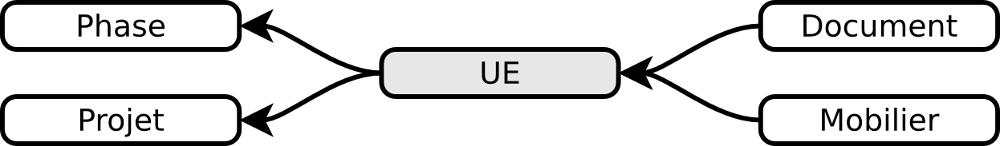

Le formulaire UE
================

Description
-----------

Une unité d'enregistrement (UE) est un terme généraliste destiné à identifier individuellement une structure, un niveau, une tranchée, etc. sans préjuger de son état (positif ou négatif) ou de son importance.

Le formulaire permet de renseigner les informations générales concernant directement l'UE mais également tous les renseignements associés tel que la documentation, la composition géologique, etc.

Renseigner
----------

Pour procéder à la création d'une nouvelle UE, il faut passer par le formulaire projet et le bouton :guilabel:`Créer` (cette fonction est limitée aux rôles ayant ce droit). 

L'UE est automatiquement liée au projet dans laquelle elle a été créée (il n'est pas possible de lier une UE à plusieurs projets).

Pour accéder aux blocs supplémentaires ou mettre en place une relation, il faut avoir impérativement enregistré la fiche au préalable.

.. note::
    **Créer une nouvelle fiche  UE**
    
    Pour créer un nouvel enregistrement UE en partant d'une fiche UE existante, il suffit de cliquer sur le lien :guilabel:`Créer une nouvelle UE`.

.. warning::
    **Suppression d'une UE = impossible !**
    
    Une UE ne peut pas être supprimée afin d'éviter la perte accidentelle d'enregistrements. Pour écarter une UE, il faut lui renseigner le type *Annulée*. De cette manière les informations la concernant sont conservées pour permettre un éventuel retour en arrière.
    
Les informations générales
^^^^^^^^^^^^^^^^^^^^^^^^^^

- **Numéro** : **saisie obligatoire**, c'est le numéro de l'unité d'enregistrement, il doit être unique et se composer d'un chiffre entier (sans virgule). Il s'agit d'un champ dont la saisie est imposée pour pouvoir procéder à la création de la fiche d'enregistrement.
- **Ancien identifiant** : ce champ est employé pour conserver les identifiants qui ne sont pas des chiffres entiers mais des chaînes de caractères variables (p. ex. mII-c15, etc.). Ce champ est exclusivement destiné aux opérations et collections anciennes.

- **Type d'UE** : **saisie obligatoire**, ce champ est une liste déroulante permettant d'indiquer s'il s'agit d'une structure, d'un niveau, d'un ensemble, d'une tranchée, d'un sondage.
- **Nature** : ce champ indique la nature de l'unité d'enregistrement en sélectionnant dans la liste déroulante le terme le plus approchant, les termes disponibles sont conditionnés par la valeur choisie dans le champ *Type d'UE*.
- **Interprétation** : ce champ indique l'interprétation de l'unité d'enregistrement en sélectionnant dans la liste déroulante le terme le plus approchant, les termes disponibles sont conditionnés par la valeur choisie dans le champ *Nature*.

- **Plan** : Forme géométrique générale d'une structure en plan
- **Profil fond** : Forme géométrique générale du fond d'une structure
- **Profil paroi** : Forme géométrique générale de la paroi verticale d'une structure

- **Chronologie début** : liste présentant les grandes périodes chronologiques (Moyen Âge, Néolithique, etc.) auxquelles peut se rattacher le début de l'UE.
- **Sous-chronologie début** : liste présentant les sous-découpages des périodes chronologiques
- **Chronologie fin** : liste présentant les grandes périodes chronologiques (Moyen Âge, Néolithique, etc.) auxquelles peut se rattacher la fin de l'UE.
- **Sous-chronologie fin** : liste présentant les sous-découpages des périodes chronologiques

- **TPQ** : Terminus Post Quem, il s'agit de la date plancher (la plus ancienne). Pour mentionner une date avant notre ère il faut rajouter un ``-`` devant et non pas *avant J.-C*. Les dates exprimées n'ont pas à être des valeurs absolues mais peuvent simplement se comprendre comme les bornes d'une période.
- **TAQ** : Terminus Ante Quem, il s'agit de la date plafond (la plus récente). Pour mentionner une date avant notre ère il faut rajouter un ``-`` devant. Les dates exprimées n'ont pas à être des valeurs absolues mais peuvent simplement se comprendre comme les bornes d'une période.

- **Commentaire** : si nécessaire, vous pouvez décrire plus en détail cette unité d'enregistrement (quelques mots au maximum). Il est déconseillé d'y faire figurer ce qui est ou peut être décrit dans un autre champ, cela permet de faciliter les recherches et d'éviter les redondances inutiles. Ce champ est limité à 255 caractères.

Les informations géographiques
^^^^^^^^^^^^^^^^^^^^^^^^^^^^^^

Le cadre cartographique présent à droite de l'écran est centré sur la géométrie de l'UE, il permet d'avoir sur un même écran toutes les informations qui lui sont attribuées ainsi que son positionnement dans le contexte du projet.

Les relations stratigraphiques
^^^^^^^^^^^^^^^^^^^^^^^^^^^^^^^^^^

Une information stratigraphique d'une UE consiste à renseigner son positionnement par rapport aux autres UE du projet.

Créer une relation
""""""""""""""""""""

..	figure:: ./fig/ue_strati_selection_ajout.png
	:align: center
	:scale: 50%

Le renseignement de l'enregistrement stratigraphique se fait selon les étapes suivantes :

#. Ouvrez une fiche d'UE enregistrée
#. Cliquez sur le bouton :guilabel:`Sélection vide` situé en haut à droite du formulaire
#. Cliquez ensuite sur :guilabel:`Ajouter l’objet courant à la sélection`, le bouton de sélection affiche maintenant *1 UE*
#. Déplacez-vous maintenant dans l'UE destinée à être mise en relation stratigraphique et cliquez de nouveau sur le bouton de sélection. La sélection affiche maintenant l'UE que vous avez précédemment placé dans votre panier.
#. Choisissez dans liste déroulante le type de la relation voulue puis cliquez sur le bouton :guilabel:`Associer`. Le sens de lecture de la relation se fait de la fiche UE courante vers la sélection du panier.

Une relation stratigraphique est maintenant établie entre l'UE de la sélection et l'UE cible. Si vous aviez indiqué que l'UE 1 *"contient"* votre sélection comportant les UE 2 et 3, alors celles-ci auront automatiquement le sens inverse de la relation, à savoir que l'UE 2 *"appartient à"* l'UE 1.

Voir les relations
"""""""""""""""""""

Toutes les relations d'une UE sont regroupées dans le bloc *Relations stratigraphiques* par type de relation. Le titre du bloc indique entre crochet *[]* le nombre d'UE liées, un sous-total est disponible en face de chaque type de relation (il faut déplier le bloc pour les voir).

Si vous cliquez sur une ligne dont l'intitulé est *sous (2)*, vous serez conduit sur une page listant toutes les UE dont la relation indique qu'elles sont *sous* l'UE courante.

L'application ne détecte pas les erreurs de circularité [#f3]_ et ne créé pas de relation récursive [#f4]_. Il n'y pas d'automatisations plus avancées telles que la création de relations récursives. Il est recommandé d'utiliser le logiciel Le Stratifiant [#f5]_ qui vous aidera à vous assurer de l'intégrité relationnelle de vos UE et à exporter les diagrammes stratigraphiques (l'export *stratigrapique simplifié* vous facilite considérablement le travail). N'attendez pas la fin de votre opération avant de procéder à ces vérifications !

.. note::
    **Remplissage rapide !**
    
    N'oubliez pas de jeter un oeil sur la section décrivant :ref:`def-remplissage-rapide` pour diviser par 10 le temps nécessaire !

Les matrices géologiques et leurs inclusions
^^^^^^^^^^^^^^^^^^^^^^^^^^^^^^^^^^^^^^^^^^^^

Chaque UE dispose d'un bloc nommé **Matrices géologiques** placé en-dessous des champs généralistes, il permet d'enregistrer les multiples matrices repérées avec les champs suivants :

	- **Primaire** : cette case est à utiliser dans le cas où il y aurait plusieurs matrices géologiques pour une même UE, le fait de cocher permet de déterminer la matrice qui est prédominante.
	- **Texture** : **saisie obligatoire**, il s'agit du type de sédiment après estimation tactile de la composition granulométrique (argile, limon, sable, etc.). Si il n'y a pas de terme recouvrant toutes les caractéristiques de la matrice, p. ex. *argile limoneuse sableuse*, c'est qu'il est plus approprié de créer une matrice primaire de texture *argile limoneuse* hétéorègne et une matrice secondaire de texture *sableuse* hétérogène
	- **Munsell** : le code Munsell est un système d’identification des couleurs permettant de palier aux différences de perceptions.
	- **Compacité** : cette liste renseigne la compacité de la matrice (meuble, compact, etc.).
	- **Homogénéité** : cette liste indique l'état d'homogénéité de la matrice (homogène ou hétérogène). Cela se détermine en regardant si la matrice de la strate est composée d’une seule texture ou de plusieurs textures mélangées qui peuvent être visuellement différenciées. Il ne s'agit pas de l'état de l'UE !

Une inclusion est un élément externe contenu dans une matrice sédimentaire, il est possible de renseigner une ou plusieurs inclusions présentes dans une matrice :

	- **Nature** : *saisie obligatoire*, cette liste permet de caractériser l'inclusion en utilisant les termes les plus fréquemment employés
	- **Taille** : cette liste donne une indication sommaire sur les dimensions de l'inclusion. Si aucune mesure ne convient, il est fort probable qu'il ne s'agisse pas d'une inclusion. Le mobilier ne correspond pas à une inclusion.
	- **Concentration** : cette liste indique quelle est la concentration des inclusions dans la matrice

.. warning::
    **Créer une inclusion**
    
    Le bloc permettant la création d'une inclusion n'est visible qu'une fois que la fiche de la matrice a été enregistrée.

Les informations de phasage
^^^^^^^^^^^^^^^^^^^^^^^^^^^

Il est possible d'assigner une UE à une ou plusieurs phases existantes (voir la section phase) en plaçant une phase dans le panier de sélection puis en se déplaçant sur la fiche UE voulue pour cliquer sur le bouton :guilabel:`Associer`. Les phases qui auront été mises en relation apparaîtront dans ce bloc.

Les informations sur le mobilier
^^^^^^^^^^^^^^^^^^^^^^^^^^^^^^^^

Ce bloc liste tous les enregistrements mobiliers liés à l'UE courante, chaque ligne représente un mobilier et indique son type ainsi que son numéro identifiant (p. ex. *Céramique - 15 (UE 1)*). L'utilisation du bouton :guilabel:`créer` permet de créer un nouveau enregistrement mobilier qui sera automatiquement lié à l'UE courante.

Les informations documentaires
^^^^^^^^^^^^^^^^^^^^^^^^^^^^^^

Ce bloc liste tous les documents liés à l'UE courante, chaque ligne représente un document et indique sa série, son dossier ainsi que son numéro identifiant (p. ex. *Administratif - Correspondance - 25*). L'utilisation du bouton :guilabel:`créer` permet de créer un nouveau document qui sera automatiquement lié à l'UE courante.

Les mesures
^^^^^^^^^^^

Il est possible de renseigner plusieurs mesures pour une UE via le bloc **Mesures** et le bouton :guilabel:`créer`. Il faut ensuite commencer par choisir le type de mesure voulue puis saisir la valeur numérique. 

Il n'est pas nécessaire d'indiquer l'unité de mesure car de manière générale les mesures de taille sont considérées comme étant en centimètre. Le séparateur décimal est le point, p. ex. *27.8* (et non pas la virgule).

Chaque mesure est associée automatiquement à l'UE à partir de laquelle elle a été créée. Il est préférable de supprimer une mesure inutile plutôt que la dissocier.

La saisie de mesures trop précises n'est pas utile car en redondance avec les mesures prises en topographie et sur les relevés de terrain. Une valeur approximative prend beaucoup moins de temps à saisir sans impacter la qualité de l'enregistrement et les possibilités de recherche (une recherche sur toutes les fosses d'incinération d'une longueur supérieure ou égale à 100cm est aussi efficace quand on se limite à saisir *100 cm*, *150 cm* que lorsque qu'on l'indique jusq'au millimètre, la seule différence est au niveau du temps passé. Rapide et efficace ou plus lent et pas plus efficace.).

Exporter
--------
Il est possible d'exporter au format CSV (voir :ref:`def-csv`) une sélection d'Unités d'Enregistrements obtenue en utilisant le moteur de recherche.

L'export disponible sous le nom *Inventaire des UE* est principalement destiné à l'intégration dans les rapports finaux d'opération et se compose des colonnes suivantes :

	- **Numéro d'UE** : identifiant unique de l'UE
	- **Type** : type de l'UE (sondage, structure, niveau, etc.)
	- **Description** :  rassemble dans une colonne le contenu des champs *Nature* et *Interprétation* (poteau - présent avec avant-trou
	- **Chronologie** : rassemble les valeurs du champs *Chronologie Début* et *Sous-Chronologie Début*
	- **Relations stratigraphiques** : rassemble l'intégralité des relations de l'UE par type (sous 321, 320, sur 323, appartient à 310)

.. csv-table:: Exemple d'export d'UE
   :header: "Numéro", "Type", "Description", "Chronologie", "Relations strati"
   :widths: 10, 20, 20, 20, 50

   322, "Niveau", "destruction", "Néolithique", "sous 321, 320, sur 323, appartient à 310"
   310, "Structure", "poteau", "Néolithique", "contient 322, sur 1"

L'export disponible sous le nom *Inventaire des UE (avec géométrie)* se compose des mêmes champs que l'exports précédents mais comporte également le contours de l'UE au format WKT (voir :ref:`def-wkt`), ce qui permet de consulter les données sous une forme cartographique dans un logiciel SIG tel que Quantum GIS.

.. [#f3] Si 1 est en-dessous de 2 et 2 en-dessous de 3 alors 1 ne peut être au-dessus de 3.
.. [#f4] Si 1 est en-dessous de 2 et 2 en-dessous de 3 alors 3 est mis en relation automatiquement sous 1.
.. [#f5] Logiciel conçu Bruno Desachy, disponible sur `le-nid-du-stratifiant.ouvaton.org <http://le-nid-du-stratifiant.ouvaton.org/>`_.

L'export disponible sous le nom *export stratigraphique simplifié* rassemble toutes les relations en ne gardant que les termes *sur*, *sous* et *synchrone* (en convertissant les autres termes). Cet export a été conçu pour être directement exploitable sous le logiciel Stratifiant.
