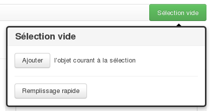

Les concepts généraux et l'interface
====================================

Les formulaires
-----------------

Un formulaire est un ensemble de champs et de listes déroulantes permettant de renseigner un enregistrement tel qu'un mobilier ou un document.

Chaque formulaire remplit le double rôle d'interface de saisie et de lecture. L'ajout et l'édition d'enregistrements se font avec la même interface et les mêmes champs que la simple lecture.

Les principaux formulaires existants  :

#. projet
#. unité d'enregistrement
#. mobilier
#. phase
#. traitement
#. régie
#. contenant
#. documentation

Le principe des blocs
^^^^^^^^^^^^^^^^^^^^^

Les blocs sont présents dans la quasi-totalité des formulaires. Ils regroupent des données sous une forme synthétique (décompte, résumé, etc.) et permettent d'accéder à d'autres formulaires de manière rapide.

Un bloc peut disposer des 2 fonctions suivantes :

- :guilabel:`Voir tout` : ce bouton affiche une page de résultat listant tous les enregistrements du même type.

- :guilabel:`Créer` : ce lien ouvre un nouveau formulaire vide prêt à être renseigné.

Le contenu du bloc se compose d'une série de liens, leur apparition est dynamique et conditionnée par les enregistrements effectués dans le projets. Un clic sur un lien peut amener :

- sur une page de résultat dans le cas d'un lien de décompte (p. ex. pour le mobilier *céramique [14]*)

- directement sur la page de l'enregistrement dans le cas d'un lien de relation (*Abandon (462 / 480)*)

Le cadre cartographique
^^^^^^^^^^^^^^^^^^^^^^

Ce cadre est présent à droite de l'écran à chaque fois qu'il est possible de localiser géographiquement un enregistrement, soit par sa position ou soit par la position d'une de ses relations.

La position de l'enregistrement apparaît en surbrillance pour le distinguer des autres formes présentes sur la carte.

Le clic gauche appuyé permet de se déplacer sur la carte tandis que la molette de la souris permet de reculer ou d'avancer le niveau de zoom.

Enregistrer un formulaire
^^^^^^^^^^^^^^^^^^^^^^^^^

Lorsque des données sont saisies dans un formulaire, il est **impératif** de cliquer sur le bouton :guilabel:`Enregistrer` pour que celles-ci soient sauvegardées par l'application. Pour éviter des erreurs de saisies non-voulues, il n'y a **aucune** sauvegarde automatisée.

.. warning::
    **Perte des modifications**
    
   Toute donnée non-enregistrée lorsque l'utilisateur quitte un formulaire est considérée comme perdue. Il est toutefois possible de revenir en arrière en utilisant la fonction *Reculer d'une page* présente dans tous les navigateurs, l'utilisateur peut alors enregistrer les données modifiées. Cette fonction est très pratique mais ne doit pas devenir un modus operandi car le nombre de retours possibles n'est pas infini, il suffirait d'un plantage de l'ordinateur pour que tout se volatilise.

Les relations
-------------

Il s'agit des associations établies entre au moins deux enregistrements, cela indique qu'ils sont liés et active certaines fonctionnalités telle que l'affichage dans un bloc.

La plupart des relations sont établies de manière automatique lors de l'utilisation du bouton :guilabel:`Créer` ou des raccourcis du genre :guilabel:`Créer un nouveau mobilier`.

Les deux principales relations sont celles entre UE et celles entre mobiliers. Ces relations peuvent avoir un type et un sens. Dans le cas d'une UE, une relation peut être *A coupé par B*. Le type est *"coupé par"*, le sens est de A vers B. Lorsque une relation est établie dans un sens, l'application crée automatiquement une relation dans le sens inverse (ici ce sera *"B est coupé par A"*.

Pour établir des relations supplémentaires, il faut utiliser le panier de sélection.

.. warning::
    **Les orphelins**
    
   Les enregistrements sans relations sont considérés comme orphelins, ces cas résultent toujours d'une action manuelle d'un utilisateur. Comme dans la vie courante, c'est une chose triste que tout le monde [1]_ aimerait éviter (voir :ref:`def-valeurs-perdues` dans la FAQ).

Le panier
-------------

Il se situe en haut à droite de l'écran sur la totalité des formulaires. Il remplit le même rôle qu'un panier de course sur un site commerçant : l'utilisateur y place les enregistrements de son choix.

Le bouton du panier affiche par défaut *Sélection vide*. Si un ajout est effectué, il affichera le nombre d'enregistrements concernés et le type général (*1 Mobilier*, *12 UEs*, etc.).

Il n'est pas possible d'avoir plusieurs enregistrements de type différents dans un même panier, il faudra par exemple choisir entre faire une sélection d'UE et faire une sélection de mobiliers.

Le remplissage se fait de deux manières :

- par lot : l'utilisateur effectue une recherche et clique sur le bouton :guilabel:`placer dans la sélection` (voir :ref:`recherche-utilisation`).
- par enregistrement : l'utilisateur se déplace sur un enregistrement existant, clique sur le panier puis clique sur :guilabel:`Ajouter  l’objet courant à la sélection`. L'action est à répéter sur chaque enregistrement que l'utilisateur veut faire figurer dans son panier.

Pour remettre la sélection à zéro, il faut cliquer dans le panier sur le lien *vider la sélection*.

Pour supprimer un enregistrement de la sélection, il faut ouvrir le panier et cliquer sur le bouton :kbd:`X` figurant à sa droite.

Se déplacer
-------------

Le fil d'Ariane
^^^^^^^^^^^^^^^^

..	figure:: ./fig/fil_ariane.png 
	:align: center
	:scale: 80%

Ce fil est toujours placé en haut de l'écran, sa fonction est d'indiquer où se situe la page lue par l'utilisateur. Son sens de lecture représente la hiérarchie des enregistrements :

- *Liste des projets /* : permet de revenir à la page d'accueil de l'application et de sélectionner un projet différent
- *2012 Mont Saint-Eloi /* : permet de revenir à la page d'accueil du projet
- *UE #1 /* : permet de revenir à la page du formulaire de cette UE
- *Céramique (UE 1)* : ce dernier apparaît grisé, il s'agit du formulaire actuellement ouvert

Il est donc ici possible de déduire l'appartenance du mobilier rien qu'en lisant ce fil et de le remonter en cliquant sur chacun des différents niveaux.

Les onglets
^^^^^^^^^^^^

Un des principaux intérêts de travailler en utilisant un navigateur internet est la possibilité d'exploiter le principe des onglets : au lieu de multiplier les fenêtres et de surcharger l'espace de travail, il est possible d'avoir plusieurs formulaires ouverts en même temps.

Si on prend le cas illustré précédemment, si l'utilisateur consultant le formulaire Céramique désire avoir les informations relatives à l'UE d'appartenance, il lui suffit d'ouvrir un onglet sur l'UE 1 sans avoir à quitter celle du mobilier.

Une autre possibilité est d'ouvrir plusieurs formulaires de saisie en ouvrant des onglets sur le raccourci :guilabel:`Créer un nouveau XXX`, ce qui permet de faire des saisies à la chaîne.

Pour ouvrir un nouvel onglet, vous pouvez :

- faire un clic droit sur un lien et cliquer sur *Ouvrir un lien dans nouvel onglet*.
- faire un clic milieu ou molette sur un lien.

.. warning::
    **Éviter les onglets périmés**
    
   Pour éviter d'avoir un onglet dont le contenu est complétement dépassé suite à des modifications d'autres utilisateurs ou la création de nouvelles relations, il faut le rafraîchir. La touche :kbd:`F5` permet d'effectuer cette action. Cela évite également d'avoir un onglet affichant un panier avec 5 enregistrements alors que l'utilisateur vient de le vider sur un autre onglet.

Les exports
--------------

Voici la liste des exports tabulés actuellement réalisables, il faut se référer à la documentation des formulaires pour avoir plus de détails sur chacun :

- Inventaires principaux
	- Inventaire des UE
	- Inventaire des contenants 
	- Inventaire général du mobilier 
	- Inventaire général du mobilier - impression 
	- Inventaire général de la documentation 
	- Inventaire général de la documentation - impression 
.. - Inventaires d'études du CDA62
.. 	- Inventaire du mobilier anthropologie 
.. 	- Inventaire du mobilier archéozoologie 
.. 	- Inventaire du mobilier céramique 
.. 	- Inventaire du mobilier lapidaire 
.. 	- Inventaire du mobilier lithique 
.. 	- Inventaire du mobilier monétaire 
.. 	- Inventaire du mobilier par UE 

.. [1] En tout cas les administrateurs du SIA.
